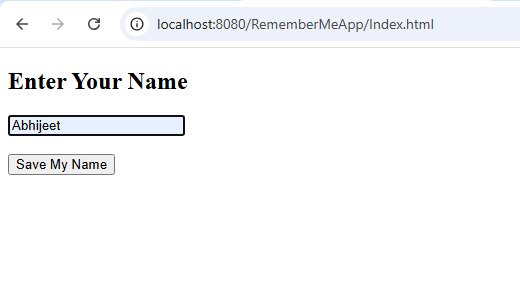
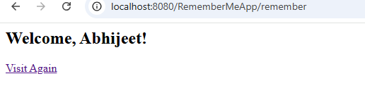
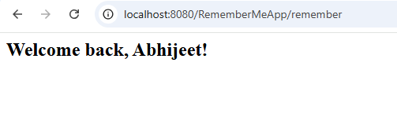

# Remember My Name (Cookie)

## Student Details

| Field       | Details                              |
|-------------|--------------------------------------|
| Name        | Abhijeet A G                         |       
| USN         | 2BL24CS400                           |
| Branch      | Computer Science & Engineering       |
| Semester    | VI Semester                          |
| Subject     | Advanced Java Programming            |
| Problem No. | Problem 31                           |

## Problem Statement

Create a 'Remember Me' application using Cookies. An HTML form accepts the user's first name. 
When submitted,the Servlet saves the name as a Cookie on the browser.The next time the user visits the page,
the Servlet reads the cookie and displays a personalised welcome-back message without asking for the name again.

## Technologies Used

- Java (Servlets)
- HTML
- Apache Tomcat 10
- Eclipse IDE

## How to Run This Project

1. Clone this repository or download the ZIP.
2. Import the project into Eclipse as a Dynamic Web Project.
3. Add Apache Tomcat 10 as the server in Eclipse.
4. Right-click project → Run As → Run on Server.
5. Open browser and go to: `http://localhost:8080/RememberMeApp/index.html`

## Screenshots

### Step 1 – Input Name 

### Step 2 – Visit Again 

### Output – Welcome Back

## Servlet Concept Practiced

HttpSession, session.setAttribute(), session.getAttribute(), session.invalidate(), Multi-step form flow, Input Validation, doGet/doPost
